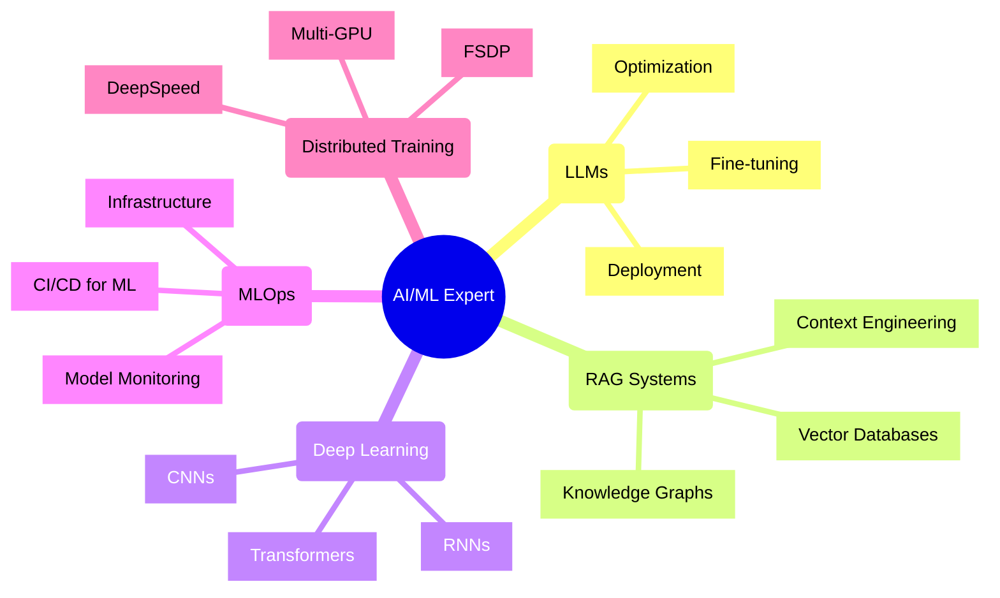
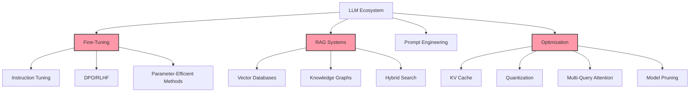

#  Hello World! I'm Ambuj Hakhu

<div align="center">
  
</div>

<p align="center">
  <a href="https://www.linkedin.com/in/ambuj-hakhu"></a>
  <a href="mailto:hakhuaj@gmail.com"></a>
  <a href="https://github.com/ambuj991"></a>
  <a href="https://www.google.com/maps/place/Cincinnati,+OH"></a>
</p>


## 🧠 AI/ML Researcher & Engineer


I specialize in developing and deploying cutting-edge machine learning and AI solutions, with expertise in:



- 🤖 **Large Language Models (LLMs)** - Fine-tuning, optimization, and deployment
- 🔄 **Retrieval-Augmented Generation (RAG)** - Building knowledge-enhanced systems
- 🧩 **Deep Learning Architectures** - CNNs, RNNs, Transformers
- 📊 **MLOps & Scalable Systems** - End-to-end ML pipelines and infrastructure
- 🚀 **Distributed Training** - Multi-GPU optimization with DeepSpeed and FSDP
- 📈 **Performance Optimization** - Quantization, KV cache, reduced precision techniques

Currently a **Machine Learning Researcher** at Subconscious AI, working on next-generation AI applications that push the boundaries of what's possible.

## 🛠️ Tech Stack


<table>
  <tr>
    <td><strong>Languages</strong></td>
    <td>
      
      
      
      
      
    </td>
  </tr>
  <tr>
    <td><strong>ML Frameworks</strong></td>
    <td>
      
      
      
      
      
    </td>
  </tr>
  <tr>
    <td><strong>LLM Expertise</strong></td>
    <td>
      
      
      
      
      
    </td>
  </tr>
  <tr>
    <td><strong>Cloud & Deployment</strong></td>
    <td>
      
      
      
      
      
    </td>
  </tr>
  <tr>
    <td><strong>Databases</strong></td>
    <td>
      
      
      
      
      
    </td>
  </tr>
  <tr>
    <td><strong>Distributed Training</strong></td>
    <td>
      
      
      
      
    </td>
  </tr>
</table>#  Hello World! I'm Ambuj Hakhu

<div align="center">
  
</div>

<div align="center">
  
</div>

<p align="center">
  <a href="https://www.linkedin.com/in/ambuj-hakhu"></a>
  <a href="mailto:hakhuaj@gmail.com"></a>
  <a href="https://github.com/ambuj991"></a>
  <a href="https://www.google.com/maps/place/Cincinnati,+OH"></a>
</p>


## 🧠 AI/ML Researcher & Engineer


I specialize in developing and deploying cutting-edge machine learning and AI solutions, with expertise in:


- 🤖 **Large Language Models (LLMs)** - Fine-tuning, optimization, and deployment
- 🔄 **Retrieval-Augmented Generation (RAG)** - Building knowledge-enhanced systems
- 🧩 **Deep Learning Architectures** - CNNs, RNNs, Transformers
- 📊 **MLOps & Scalable Systems** - End-to-end ML pipelines and infrastructure
- 🚀 **Distributed Training** - Multi-GPU optimization with DeepSpeed and FSDP
- 📈 **Performance Optimization** - Quantization, KV cache, reduced precision techniques

Currently a **Machine Learning Researcher** at Subconscious AI, working on next-generation AI applications that push the boundaries of what's possible.


## 🛠️ Tech Stack


<table>
  <tr>
    <td><strong>Languages</strong></td>
    <td>
      
      
      
      
      
    </td>
  </tr>
  <tr>
    <td><strong>ML Frameworks</strong></td>
    <td>
      
      
      
      
      
    </td>
  </tr>
  <tr>
    <td><strong>LLM Expertise</strong></td>
    <td>
      
      
      
      
      
    </td>
  </tr>
  <tr>
    <td><strong>Cloud & Deployment</strong></td>
    <td>
      
      
      
      
      
    </td>
  </tr>
  <tr>
    <td><strong>Databases</strong></td>
    <td>
      
      
      
      
      
    </td>
  </tr>
  <tr>
    <td><strong>Distributed Training</strong></td>
    <td>
      
      
      
      
    </td>
  </tr>
</table>#  Hello World! I'm Ambuj Hakhu

<div align="center">
  
</div>

<div align="center">
  
</div>

<p align="center">
  <a href="https://www.linkedin.com/in/ambuj-hakhu"></a>
  <a href="mailto:hakhuaj@gmail.com"></a>
  <a href="https://github.com/ambuj991"></a>
  <a href="https://www.google.com/maps/place/Cincinnati,+OH"></a>
</p>


## 🧠 AI/ML Researcher & Engineer


I specialize in developing and deploying cutting-edge machine learning and AI solutions, with expertise in:


- 🤖 **Large Language Models (LLMs)** - Fine-tuning, optimization, and deployment
- 🔄 **Retrieval-Augmented Generation (RAG)** - Building knowledge-enhanced systems
- 🧩 **Deep Learning Architectures** - CNNs, RNNs, Transformers
- 📊 **MLOps & Scalable Systems** - End-to-end ML pipelines and infrastructure
- 🚀 **Distributed Training** - Multi-GPU optimization with DeepSpeed and FSDP
- 📈 **Performance Optimization** - Quantization, KV cache, reduced precision techniques

Currently a **Machine Learning Researcher** at Subconscious AI, working on next-generation AI applications that push the boundaries of what's possible.

## 🛠️ Tech Stack

<table>
  <tr>
    <td><strong>Languages</strong></td>
    <td>
      
      
      
      
      
    </td>
  </tr>
  <tr>
    <td><strong>ML Frameworks</strong></td>
    <td>
      
      
      
      
      
    </td>
  </tr>
  <tr>
    <td><strong>LLM Expertise</strong></td>
    <td>
      
      
      
      
      
    </td>
  </tr>
  <tr>
    <td><strong>Cloud & Deployment</strong></td>
    <td>
      
      
      
      
      
    </td>
  </tr>
  <tr>
    <td><strong>Databases</strong></td>
    <td>
      
      
      
      
      
    </td>
  </tr>
  <tr>
    <td><strong>Distributed Training</strong></td>
    <td>
      
      
      
      
    </td>
  </tr>
</table>

## 🚀 Featured Projects

<div align="center">
  
</div>

### 🔍 Graph-based RAG System
*A scalable knowledge retrieval system processing 1M+ data points*
```
📊 Neo4j + 🧠 OpenAI embeddings + ⛓️ LangChain
```
- Built multi-threaded pipeline for schema creation and vector indexing
- Implemented advanced caching (LRU) and modular LLM query pipelines
- Designed dynamic prompt templates for context-aware retrieval
- **Technologies**: Neo4j, LangChain, OpenAI Embeddings, Python

### 🎨 [Deep Convolutional Illustration Synthesis using GANs](https://github.com/ambuj991/dcgan-anime)
*Creating unique anime-style images with advanced deep learning techniques*
```
🖼️ GAN + 📐 Bilinear Upsampling + 🔍 Minibatch Discrimination
```
- Generated unique anime-style images from 20,000+ training samples
- Implemented advanced GAN architecture with supplementary fully connected layers
- Created reference implementation for digital image synthesis applications
- **Technologies**: PyTorch, GANs, CNN, CUDA

### 🎯 [Intent Classification and Sarcasm Detection](https://github.com/ambuj991/intent-sarcasm-detection)
*NLP system with 82% accuracy for intent recognition and sarcasm detection*
```
🤖 BERT + 📝 RNNs + 🧠 LSTMs
```
- Developed web-based NLP system with Flask and TensorFlow
- Constructed scalable data pipeline for feature extraction and storage
- Achieved 82% accuracy through model validation and performance tuning
- **Technologies**: TensorFlow, BERT, Flask, SQLite

### 📝 [Text Summarization with N-gram Evaluation](https://github.com/ambuj991/weighted-ngram-summarization)
*State-of-the-art text summarization with 9.5% Rouge-2 F1 score*
```
📊 T5 + 📚 XSum + 📈 Rouge Metrics
```
- Fine-tuned T5 model on the XSum dataset for concise, informative summaries
- Improved evaluation metrics beyond traditional N-gram based methods
- Enhanced contextual word similarity for better summary assessment
- **Technologies**: Transformers, HuggingFace, PyTorch, NLTK

<div align="center">
  <a href="https://github.com/ambuj991?tab=repositories">
    
  </a>
</div>

<details>
  <summary><b>📂 More Projects</b></summary>
  
  <table>
    <tr>
      <td>
        <a href="https://github.com/ambuj991/Sentiment-Analysis-Model">
          <b>💬 Sentiment Analysis</b>
        </a>
        <br>
        Advanced sentiment analysis using transformer-based models achieving high accuracy on complex texts.
      </td>
      <td>
        <a href="https://github.com/ambuj991/Text-Summarization-Model-Using-LLMs">
          <b>📝 Text Summarization with LLMs</b>
        </a>
        <br>
        Leveraging Meta's Llama2 and OpenAI's GPT3.5 for high-quality text summarization.
      </td>
    </tr>
    <tr>
      <td>
        <a href="https://github.com/ambuj991/gpt3-ambBOT">
          <b>🤖 Personal ChatBOT Application</b>
        </a>
        <br>
        Custom chatbot implementation using GPT models with personalized knowledge integration.
      </td>
      <td>
        <a href="https://github.com/ambuj991/Handwritten-digits-classification-using-neural-network">
          <b>✍️ Handwritten Digit Recognition</b>
        </a>
        <br>
        Neural network approach to accurately classify handwritten digits with optimized performance.
      </td>
    </tr>
    <tr>
      <td>
        <a href="https://github.com/ambuj991/Dockship-Image-Classification">
          <b>🖼️ Unbalanced Dockship Image Classification</b>
        </a>
        <br>
        Addressing class imbalance challenges in image classification with innovative techniques.
      </td>
      <td>
        <a href="#">
          <b>🚗 Autonomous Vehicle Obstacle Detection</b>
        </a>
        <br>
        Real-time object detection system for identifying and classifying obstacles in driving scenarios.
      </td>
    </tr>
  </table>
</details>

### 🔍 Graph-based RAG System
*A scalable knowledge retrieval system processing 1M+ data points*
```
📊 Neo4j + 🧠 OpenAI embeddings + ⛓️ LangChain
```
- Built multi-threaded pipeline for schema creation and vector indexing
- Implemented advanced caching (LRU) and modular LLM query pipelines
- Designed dynamic prompt templates for context-aware retrieval
- **Technologies**: Neo4j, LangChain, OpenAI Embeddings, Python

### 🎨 [Deep Convolutional Illustration Synthesis using GANs](https://github.com/ambuj991/dcgan-anime)
*Creating unique anime-style images with advanced deep learning techniques*
```
🖼️ GAN + 📐 Bilinear Upsampling + 🔍 Minibatch Discrimination
```
- Generated unique anime-style images from 20,000+ training samples
- Implemented advanced GAN architecture with supplementary fully connected layers
- Created reference implementation for digital image synthesis applications
- **Technologies**: PyTorch, GANs, CNN, CUDA

### 🎯 [Intent Classification and Sarcasm Detection](https://github.com/ambuj991/intent-sarcasm-detection)
*NLP system with 82% accuracy for intent recognition and sarcasm detection*
```
🤖 BERT + 📝 RNNs + 🧠 LSTMs
```
- Developed web-based NLP system with Flask and TensorFlow
- Constructed scalable data pipeline for feature extraction and storage
- Achieved 82% accuracy through model validation and performance tuning
- **Technologies**: TensorFlow, BERT, Flask, SQLite

### 📝 [Text Summarization with N-gram Evaluation](https://github.com/ambuj991/weighted-ngram-summarization)
*State-of-the-art text summarization with 9.5% Rouge-2 F1 score*
```
📊 T5 + 📚 XSum + 📈 Rouge Metrics
```
- Fine-tuned T5 model on the XSum dataset for concise, informative summaries
- Improved evaluation metrics beyond traditional N-gram based methods
- Enhanced contextual word similarity for better summary assessment
- **Technologies**: Transformers, HuggingFace, PyTorch, NLTK

## 📈 LLM & ML Engineering Expertise

<div align="center">
  
</div>



## 📊 Weekly Development Breakdown
<div align="center">
  
</div>

<!--START_SECTION:waka-->
```text
Python       ██████████████▓░░░░░░  65.76%
JavaScript   ██████░░░░░░░░░░░░░░░  25.84%
Markdown     ██▒░░░░░░░░░░░░░░░░░░   8.21%
YAML         ▒░░░░░░░░░░░░░░░░░░░░   2.01%
Other        ▒░░░░░░░░░░░░░░░░░░░░   1.18%
```
<!--END_SECTION:waka-->

## 🎓 Education & Certifications

<div align="center">
  
</div>

<div align="center">
  <table>
    <tr>
      <td align="center">
        
        <br>
        <b>M.S. Computer Science</b>
        <br>
        2024, GPA: 3.8/4.0
      </td>
      <td align="center">
        
        <br>
        <b>B.Tech Electronics and Telecommunications</b>
        <br>
        2023
      </td>
    </tr>
  </table>
</div>

### Professional Certifications
<div align="center">
  
  
  
  
</div>

## 🏆 Awards & Achievements

<div align="center">
  
</div>

<table>
  <tr>
    <td align="center">
      
      <br>
      <small>Outstanding Academic Performance</small>
      <br>
      <small>University of Cincinnati</small>
    </td>
    <td align="center">
      
      <br>
      <small>Liftoff Hackathon</small>
      <br>
      <small>NMIMS University</small>
    </td>
    <td align="center">
      
      <br>
      <small>Mukesh Patel Intercollege Hackathon</small>
    </td>
  </tr>
</table>

## 💻 Open Source Contributions

<div align="center">
  <table>
    <tr>
      <td align="center">
        <a href="#">
          
        </a>
        <p>Contributed optimizations for T5 model fine-tuning</p>
      </td>
      <td align="center">
        <a href="#">
          
        </a>
        <p>Added custom retriever classes for RAG systems</p>
      </td>
      <td align="center">
        <a href="#">
          
        </a>
        <p>Implemented GPU memory optimization techniques</p>
      </td>
    </tr>
  </table>
</div>

## 📚 Research & Publications

<div align="center">
  <table>
    <tr>
      <td>
        <a href="#">
          
        </a>
        <p>Proposed novel architectures for enterprise knowledge retrieval systems using graph databases for context enrichment.</p>
      </td>
      <td>
        <a href="#">
          
        </a>
        <p>Explored resource-optimized methods for adapting large language models to domain-specific tasks.</p>
      </td>
    </tr>
  </table>
</div>

## 💡 Latest Blog Posts
<!-- BLOG-POST-LIST:START -->
- [Fine-tuning LLMs with DPO: A Practical Guide](#)
- [Building RAG Systems that Scale: Lessons Learned](#)
- [Multi-GPU Training with DeepSpeed and FSDP](#)
- [Knowledge Graphs for LLM Context Enhancement](#)
<!-- BLOG-POST-LIST:END -->

## 📊 Weekly Development Breakdown
<!--START_SECTION:waka-->
```text
Python       ██████████████▓░░░░░░  65.76%
JavaScript   ██████░░░░░░░░░░░░░░░  25.84%
Markdown     ██▒░░░░░░░░░░░░░░░░░░   8.21%
YAML         ▒░░░░░░░░░░░░░░░░░░░░   2.01%
Other        ▒░░░░░░░░░░░░░░░░░░░░   1.18%
```
<!--END_SECTION:waka-->

## 📫 Let's Connect!

<div align="center">
  
</div>

<div align="center">
  <table>
    <tr>
      <td align="center">
        <a href="mailto:hakhuaj@gmail.com">
          
          <br>
          <b>Email</b>
        </a>
      </td>
      <td align="center">
        <a href="https://www.linkedin.com/in/ambuj-hakhu">
          
          <br>
          <b>LinkedIn</b>
        </a>
      </td>
      <td align="center">
        <a href="https://github.com/ambuj991">
          
          <br>
          <b>GitHub</b>
        </a>
      </td>
    </tr>
  </table>
</div>

## 📫 Let's Connect!

<div align="center">
  
</div>

<div align="center">
  <table>
    <tr>
      <td align="center">
        <a href="mailto:hakhuaj@gmail.com">
          
          <br>
          <b>Email</b>
        </a>
      </td>
      <td align="center">
        <a href="https://www.linkedin.com/in/ambuj-hakhu">
          
          <br>
          <b>LinkedIn</b>
        </a>
      </td>
      <td align="center">
        <a href="https://github.com/ambuj991">
          
          <br>
          <b>GitHub</b>
        </a>
      </td>
    </tr>
  </table>
</div>

<div align="center">
  
</div>

---

<div align="center">
  
  <br>
  
</div>m/readme/master/assets/lines/colored.png" width="100%">
  
  <br>
  
</div>m/readme/master/assets/lines/colored.png" width="100%">
  
  <br>
  
</div>
