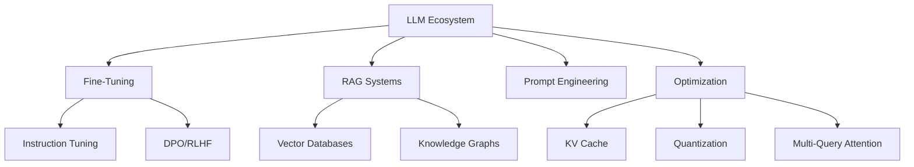

# 👋 Hello World! I'm Ambuj Hakhu

[](https://www.linkedin.com/in/ambuj-hakhu)
[](mailto:hakhuaj@gmail.com)
[](https://www.google.com/maps/place/Cincinnati,+OH)

## 🧠 AI/ML Researcher & Engineer

I specialize in developing and deploying cutting-edge machine learning and AI solutions, with expertise in:

- 🤖 **Large Language Models (LLMs)** - Fine-tuning, optimization, and deployment
- 🔄 **Retrieval-Augmented Generation (RAG)** - Building knowledge-enhanced systems
- 🧩 **Deep Learning Architectures** - CNNs, RNNs, Transformers
- 📊 **MLOps & Scalable Systems** - End-to-end ML pipelines and infrastructure

Currently a **Machine Learning Researcher** at Subconscious AI, working on next-generation AI applications that push the boundaries of what's possible.

## 🛠️ Tech Stack

```python
tech_stack = {
    "languages": ["Python", "C/C++", "JavaScript", "SQL", "Java"],
    "ml_frameworks": ["PyTorch", "TensorFlow", "LangChain", "Transformers", "NLTK"],
    "llm_expertise": ["Llama2", "Mixtral", "OpenAI", "DPO/RLHF", "RAG Systems"],
    "deployment": ["AWS", "Docker", "Kubernetes", "Flask", "FastAPI"],
    "databases": ["PostgreSQL", "MySQL", "Neo4j", "VectorDB (Pinecone, ChromaDB)"],
    "distributed_training": ["DeepSpeed", "FSDP", "Megatron", "Multi-GPU Systems"]
}
```

## 🔥 Featured Projects

### Graph-based RAG System
*A scalable knowledge retrieval system processing 1M+ data points*
- Integrated Neo4j, OpenAI embeddings, and LangChain
- Built multi-threaded pipeline for schema creation and vector indexing
- Implemented advanced caching (LRU) and modular LLM query pipelines

### [Deep Convolutional Illustration Synthesis using GANs](https://github.com/ambuj991/dcgan-anime)
- Generated unique anime-style images from 20,000+ training samples
- Implemented advanced GAN architecture with bilinear upsampling and minibatch discrimination
- Created reference implementation for digital image synthesis applications

### [Intent Classification and Sarcasm Detection](https://github.com/ambuj991/intent-sarcasm-detection)
- Developed NLP system using RNNs, LSTMs, and BERT
- Achieved 82% accuracy through model validation and performance tuning
- Deployed as FaaS with Flask and TensorFlow

### [Text Summarization with N-gram Evaluation](https://github.com/ambuj991/weighted-ngram-summarization)
- Fine-tuned T5 model on XSum dataset achieving 9.5% Rouge-2 F1 score
- Improved evaluation metrics beyond traditional N-gram based methods
- Enhanced contextual word similarity for better summary assessment

## 📈 LLM & ML Engineering Expertise



## 🎓 Education & Certifications

- 🎓 **M.S. Computer Science** - University of Cincinnati (2024, GPA: 3.8/4.0)
- 🎓 **B.Tech Electronics and Telecommunications** - SVKM's NMIMS University (2023)
- 📜 Google Cloud Platform Machine Learning Certification
- 📜 Certified Machine Learning & Data Scientist by Datacamp
- 📜 Data Structures & Algorithms certified by Coursera

## 🏆 Awards & Achievements

- 🏅 GIA Scholarship for outstanding academic performance - University of Cincinnati
- 🥈 Runner-up at Liftoff Hackathon - NMIMS University
- 🏆 "Innovative Research Project" award - Mukesh Patel Intercollege Hackathon

## 📫 Let's Connect!

I'm always open to interesting collaborations, research opportunities, or just geeking out about the latest in AI/ML. Feel free to reach out through:

- 📧 Email: [hakhuaj@gmail.com](mailto:hakhuaj@gmail.com)
- 🔗 LinkedIn: [Connect with me](https://www.linkedin.com/in/ambuj-hakhu)
- 🐱 GitHub: You're already here!

---

*"The goal is to turn data into information, and information into insight."* - Carly Fiorina
